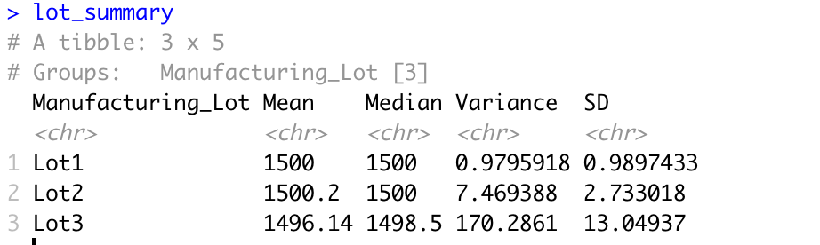

# MechaCar_Statistical_Analysis

## Overview 
The companies new prototype the "MechaCar" is currently suffering from production issues. It is my job to perform a statistical analysis in order solve this prodcution issue by looking at possible adjustments that can be made for production.

## Linear Regression To Predict MPG

The first item on the agenda is the current issue with the fuel efficiency of the vehicle. In order to combat this issue, I will create a multi-linear regression model from production data in order to find out "which independent variables are most likely to predict the MPG of the new MechaCar?" 

To run this analysis, my dependent variable will be MPG. My independent variables will be vehicle length, width, spoiler angle, ground clearance, and AWD. I will also be using the standard p-value of .05 throughout this analysis. The image below is the result of my linear regression model. 

***Key Questions***

- Which variables/coefficients provided a non-random amount of variance to the mpg values in the dataset?
  - In order to find out which variables contribute the most amount of variance to the MPG values, we must look at the **Pr(>|t|)** values, or as it is better known, the p-value. The p-value represents how much variance each variable contributes to the multi-linear regression model. In order to find out which variables contribute most to MPG, we must find values less than the .05 significance level. Looking at our results we can see that vehicle length and ground clearance are the best indicators of mpg since they statistically less likely to contribure random variance to the model.

- What is the slope of the linear model?
  - The slope of the the linear regression model will be in the "Estimate" column. In the estimate column we can see the the slope of each coefficient as it pertains to our mpg values. The value of the entire model as a whole is the "-1.040e+02" that is on the intercept row. The negative value in our slope indicates that the overall relationship of these variables on mpg is one that decreases mpg the more our independent variable increase.

- Does this linear model predict mpg of MechaCar prototypes effectively?
  - In order to identify if this model is a good predictor of mpg, we must look at our R-squared value. The r-squared statistics tells us how well our model fits the data. The r-squared value of this model is .71, this states that 71% of of the variance of this model can be contributed to the 5 other variables. With an r-squared value as high as .71, it is clear that this model represents a strong amount of the correlation observed in this model.

## Summary Statistics on Suspension Coils

The next item on the agenda are the suspension coils of the car, more importantly the PSI (pounds per square inch) of the MechaCar production lots. Below are the PSI production measures of all lots, followed by the production by lot measured by central tendency and variance.

#### Summary by lot

**Key Findings**
The design specifications of the MechaCar suspension coils dictate that the variance of the suspension coils not exceed 100 pounds per square inch. Overall we meet this mark, as the variance across all lot is 62.29. However, when we look at the results per lot we can see that the lot 3 falls way below these production standards.

## T-Tests on Suspension Coils

Finally I will need to run a t-test in order to compare the means between the samples and the data. For the t-test, I will be checking to see if there are similar weight capacities of multiple suspension coils in order to see if each lot maintains the same consistency in production. The null hypothesis for this test is that the true mean of the sample is equal to the true mean of the population. Below is an image of the t-test results for lot 1.

Here we can see that lot 1 has p-value of 1. The p-value of lot 1 indicates that the sample mean for lot 1 matches the population mean of the population of cars produced. This is no surprise there, as the previous analysis showed a mean of 1500 for lot 1, with very low variance in the data.

Lot 2 had a p-value of .60 indicating that its mean also closely resembles our production standards, meaning that it is not likely that the differences that we observe are due to a bad sample. For lot 2 we can be fairly confident that the sample is representative of our population mean of 1500 and we would fail to reject our null hypothesis. However, lot 3 had a p-value of .04, which is below .05. The t-test for lot 3 is forces me to reject the null hypothesis implicating that there is a difference in the mean of the sample and the population.